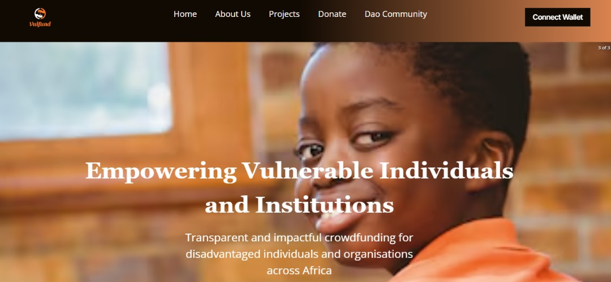
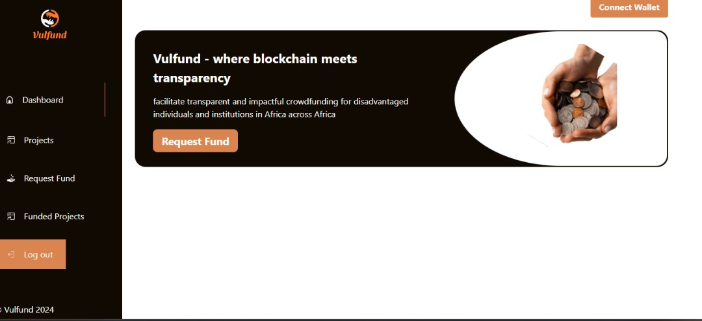

### Vulfund

##  Overview:

Vulfund is a blockchain-based platform that leverages the power of Decentralized Autonomous Organizations (DAOs) to facilitate transparent and impactful crowdfunding for disadvantaged individuals and institutions in Africa across Africa. It empowers users to directly support orphanages, senior citizen homes, homes for disabled individuals, and other underprivileged groups in Africa by crowdfunding and voting on funding requests from registered vulnerable institutions.

## Problem Statement:

In Africa, less privileged communities such as motherless baby homes, orphanages, senior citizen homes, homes for disabled or special needs people, and other underprivileged communities struggle to access essential resources such as food, healthcare, education, and skill development.

The traditional fundraising methods for this social causes in Africa often lack transparency and control over how funds are used as a result of the centralized donation systems that faces issues of trust and efficiency, suffer from high administrative fees, and face challenges in reaching a global audience. This limits the support available to those in desperate need.

## Solution & Objectives:

Vulfund addresses these issues by:

* Decentralization: Utilizing blockchain technology to create a transparent and secure platform, eliminating intermediaries and ensuring all donations reach their intended recipients.

* DAO Governance: Empowering donors to collectively decide on funding allocation through community voting.

* Direct Impact and global reach: Providing a platform for underprivileged institutions to register their needs and receive direct financial support for essential needs like food, healthcare, education, and skills training from a global crowdfunding community.

## Screenshots

- 1

- 2

## Target Market

Majorly are global donors and African beneficiaries
* Orphanages, Senior Citizen Homes, Disability Centers
* Donors and Philanthropic Individuals or Organizations

## Tools:

Lisk, Solidity, Foundry, Typescript, Bash, Tenderly, Solidity, Vite, react, Tailwind css, Web3 modal, Pinata, Ipfs etc

## Deployed Address on Lisk:

0x9342dBCC8cb00819B250df7526FfDb6B849732d3

## Pitchdeck:

https://www.canva.com/design/DAGR3tSXCfc/BgMHYe3XrA-UFy_DYFSkig/view?utm_content=DAGR3tSXCfc&utm_campaign=designshare&utm_medium=link&utm_source=editor

## Demo Video: 
https://youtu.be/bxoJzgoQU9s

### Team Information:
1. Clementina Odegha - Product Manager
2. Adetoro Odun - Product Designer
3. Sanni Ifeoluwa - Frontend Developer
4. Atoyebi Kemi - Frontend Developer
5. Adewale Iyanuoluwa - Smart Contract Developer
